# 🚀 Platform Engineering — WordPress Multi-Environnements sur Kubernetes

> **Projet de formation Platform Engineering** — EazyTraining | Mars 2026  
> Déploiement d'une architecture cloud-native complète avec GitOps, multi-environnements, déploiements progressifs et observabilité DORA.

---

## 📋 Résumé du Projet

Ce projet démontre la mise en œuvre d'une **Internal Developer Platform (IDP)** complète sur Kubernetes (DigitalOcean), permettant à des équipes applicatives de déployer et gérer WordPress en self-service, avec des garanties de qualité et de fiabilité de niveau production.

### 🎯 Objectifs atteints

| Objectif | Résultat |
|----------|----------|
| Architecture GitOps 100% | ✅ ArgoCD + GitHub comme source de vérité |
| Multi-environnements isolés | ✅ Production + Staging + vClusters Dev |
| Déploiements progressifs | ✅ Canary + Blue/Green avec Argo Rollouts |
| Runtime distribué | ✅ Dapr sidecar injecté sur WordPress |
| Métriques DORA | ✅ Keptn + Prometheus + Grafana |
| Infrastructure as Code | ✅ Crossplane (Helm releases déclaratives) |

---

## 🏗️ Architecture

```
┌─────────────────────────────────────────────────────────────────┐
│                    DOKS — DigitalOcean Kubernetes               │
│                    2 × s-4vcpu-8GB | K8s v1.35.1                │
│                                                                  │
│  ┌──────────────┐  ┌──────────────┐  ┌──────────────────────┐  │
│  │ ingress-nginx │  │   argocd     │  │  crossplane-system   │  │
│  │ LB: 168.144  │  │ LB: 139.59   │  │  + provider-helm     │  │
│  └──────────────┘  └──────────────┘  └──────────────────────┘  │
│                                                                  │
│  ┌──────────────────────────┐  ┌──────────────────────────────┐ │
│  │     wordpress (prod)     │  │   wordpress-staging          │ │
│  │  MariaDB + Redis + WP    │  │  MariaDB + Redis + WP        │ │
│  │  Dapr sidecar 2/2 ✅     │  │  Isolé, stack complète ✅    │ │
│  └──────────────────────────┘  └──────────────────────────────┘ │
│                                                                  │
│  ┌──────────────┐  ┌──────────────┐  ┌──────────────────────┐  │
│  │  dev-team    │  │ staging-team │  │   argo-rollouts      │  │
│  │  vCluster    │  │  vCluster    │  │  Canary + BlueGreen  │  │
│  └──────────────┘  └──────────────┘  └──────────────────────┘  │
│                                                                  │
│  ┌──────────────────────────────────────────────────────────┐   │
│  │  monitoring: Prometheus + Grafana + Keptn (DORA)         │   │
│  │  dapr-system: operator + placement + sentry + injector   │   │
│  └──────────────────────────────────────────────────────────┘   │
└─────────────────────────────────────────────────────────────────┘
```

---

## 🛠️ Stack Technique

### Infrastructure
| Composant | Version | Rôle |
|-----------|---------|------|
| DigitalOcean Kubernetes (DOKS) | v1.35.1 | Cluster managé cloud |
| Ingress Nginx | latest | Point d'entrée HTTP unique, routing |
| Cilium | natif DO | CNI — réseau inter-pods |
| do-block-storage | - | StorageClass default, PVC dynamiques |

### GitOps & IaC
| Composant | Version | Rôle |
|-----------|---------|------|
| ArgoCD | v3.3.2 | Opérateur GitOps — sync Git → cluster |
| Crossplane | v2.2.0 | Control plane IaC Kubernetes-natif |
| Provider Helm | v1.2.0 | Releases Helm déclaratives (CRD) |

### Applications
| Composant | Version | Rôle |
|-----------|---------|------|
| WordPress | 24.1.7 (Bitnami) | Application principale |
| MariaDB | 20.2.1 (Bitnami) | Base de données |
| Redis | 20.6.3 (Bitnami) | Cache + State Store Dapr |

### Platform Engineering
| Composant | Version | Rôle |
|-----------|---------|------|
| vCluster | v0.32.1 | Clusters K8s virtuels (dev/staging) |
| Dapr | v1.14 | Runtime distribué — sidecar microservices |
| Argo Rollouts | v1.8.4 | Déploiements Canary et Blue/Green |

### Observabilité
| Composant | Version | Rôle |
|-----------|---------|------|
| Prometheus | kube-prometheus-stack | Collecte métriques cluster |
| Grafana | - | Dashboards (IP : 104.248.101.167) |
| Keptn Lifecycle Toolkit | latest | Métriques DORA automatisées |
| cert-manager | v1.13.0 | Gestion certificats TLS |

---

## 📁 Structure du Repository

```
gitops-wordpress/
├── apps/                          ← Production
│   ├── mariadb-release.yaml        Release Crossplane : MariaDB
│   ├── redis-release.yaml          Release Crossplane : Redis
│   ├── wordpress-release.yaml      Release Crossplane : WordPress
│   └── wordpress-ingress.yaml      Ingress → wordpress.dev.local
│
├── apps-staging/                  ← Staging / UAT
│   ├── mariadb-release.yaml        Release : mariadb-staging
│   ├── redis-release.yaml          Release : redis-staging
│   ├── wordpress-release.yaml      Release : wordpress-staging
│   └── wordpress-ingress.yaml      Ingress → wordpress-staging.local
│
├── argocd-app.yaml                Application ArgoCD production
├── argocd-app-staging.yaml        Application ArgoCD staging
├── provider-helm.yaml             Crossplane Provider Helm
├── provider-helm-rbac.yaml        ClusterRoleBinding SA dynamique
├── provider-helm-config.yaml      ProviderConfig (InjectedIdentity)
├── dapr-components.yaml           State Store + Pub/Sub (Redis)
├── rollout-canary.yaml            Argo Rollouts — stratégie Canary
├── rollout-bluegreen.yaml         Argo Rollouts — stratégie Blue/Green
└── screenshots/                   Captures d'écran du projet
```

---

## 🔄 Workflow GitOps

```
Developer          GitHub              ArgoCD           Kubernetes
    │                 │                   │                  │
    │── git push ────►│                   │                  │
    │                 │── webhook ────────►│                  │
    │                 │                   │── sync ─────────►│
    │                 │                   │   (Crossplane)   │
    │                 │                   │                  │── helm install
    │                 │                   │◄─ reconcile ─────│
    │                 │                   │   Healthy ✅     │
```

**Principe** : Tout changement applicatif passe par un commit Git. ArgoCD détecte le changement et applique automatiquement l'état désiré dans le cluster. Le cluster reflète **toujours** exactement ce qui est dans Git.

### ArgoCD — Applications GitOps

<p align="center">
  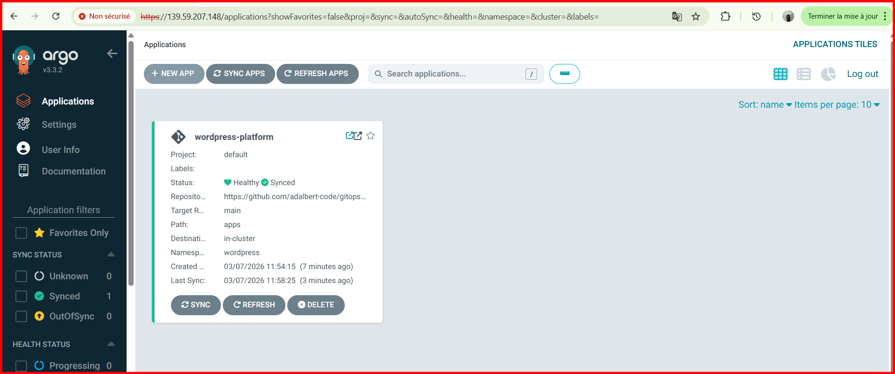
  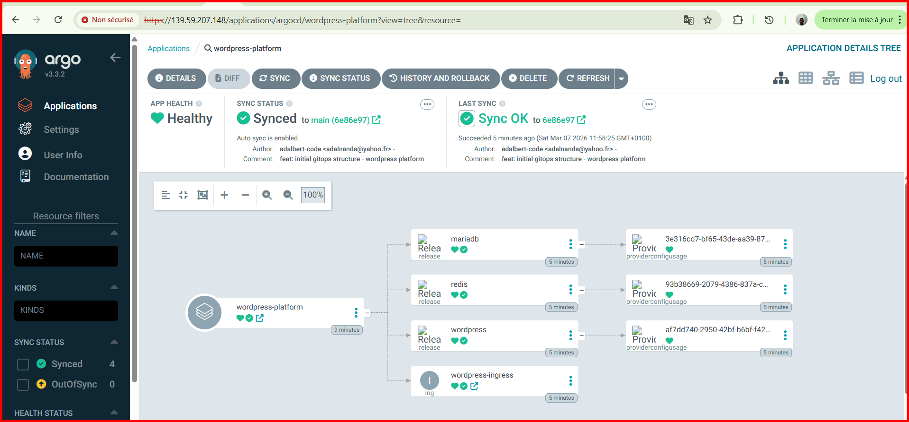
</p>
<p align="center">
  <em>ArgoCD — Vue d'ensemble des applications &nbsp;&nbsp;|&nbsp;&nbsp; wordpress-platform Synced ✅ Healthy ✅</em>
</p>

<p align="center">
  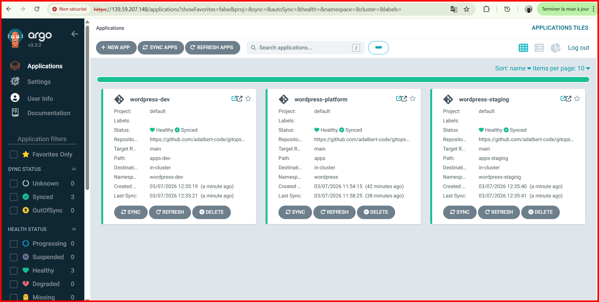
</p>
<p align="center">
  <em>ArgoCD — Application vCluster déployée et synchronisée</em>
</p>

---

## 🚀 Déploiements Progressifs

### Stratégie Canary

Déploiement progressif avec validation automatique des métriques à chaque étape.

```
v1 (stable) ──────────────────────────────────────► 0%  (scalé à 0)
v2 (canary)  ──► 20% ──► 40% ──► 60% ──► 80% ──► 100% (nouvelle stable)
                 30s       30s     pause   30s
                                  manuelle
```

**Commandes clés :**
```bash
# Déclencher un rollout
kubectl-argo-rollouts set image wordpress-canary wordpress=nginx:latest -n wordpress

# Promouvoir manuellement
kubectl-argo-rollouts promote wordpress-canary -n wordpress

# Rollback en cas de problème
kubectl-argo-rollouts abort wordpress-canary -n wordpress
kubectl-argo-rollouts undo wordpress-canary -n wordpress
```

#### Screenshots — Canary en action

<p align="center">
  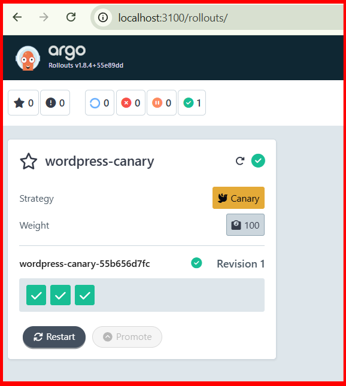
  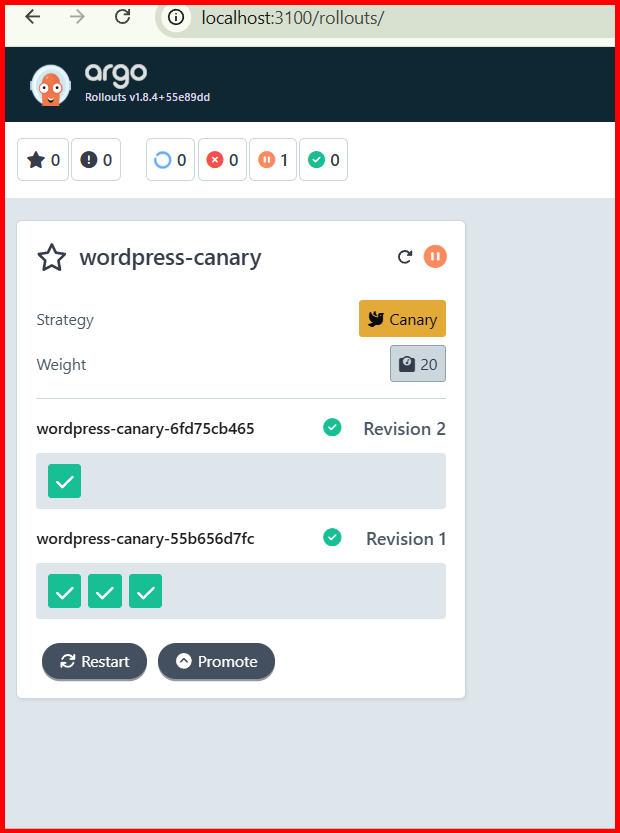
</p>
<p align="center">
  <em>Dashboard Argo Rollouts &nbsp;&nbsp;|&nbsp;&nbsp; Canary — Revision 1 stable (état initial)</em>
</p>

<p align="center">
  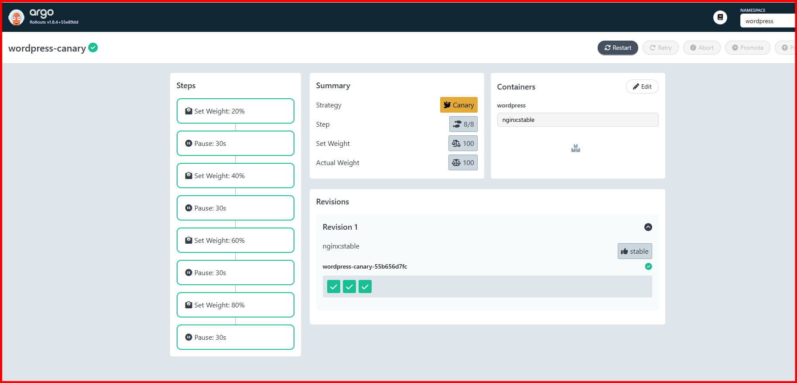
  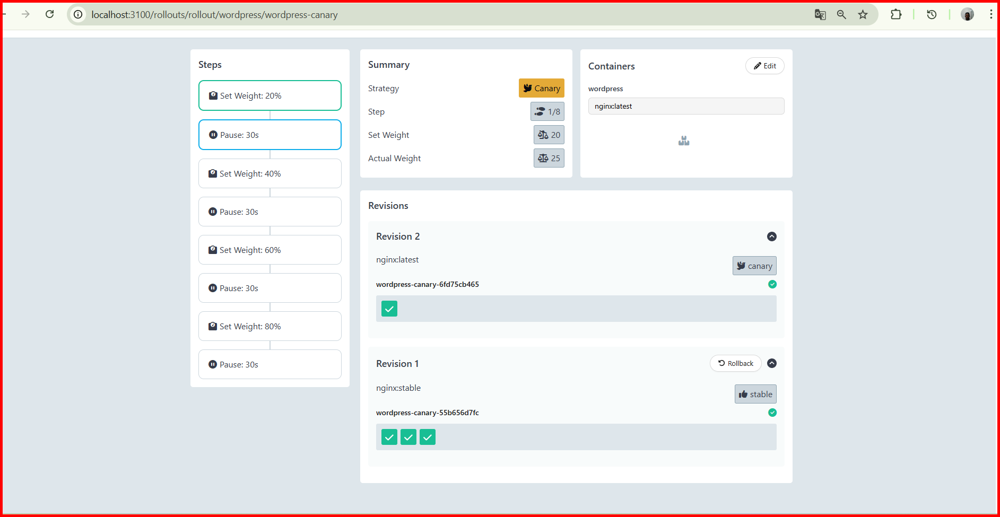
</p>
<p align="center">
  <em>Canary — Trafic à 20% vers la nouvelle version &nbsp;&nbsp;|&nbsp;&nbsp; Canary — Progression à 40%</em>
</p>

<p align="center">
  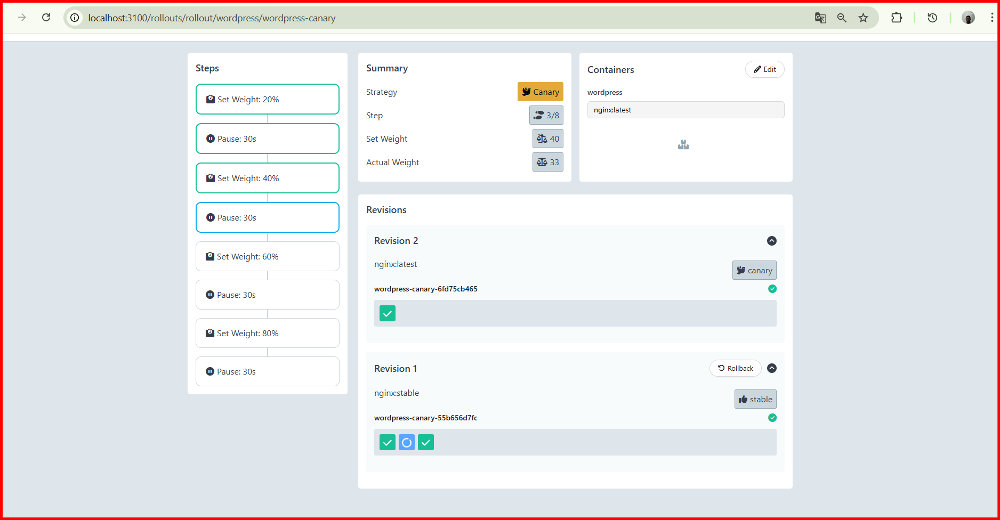
  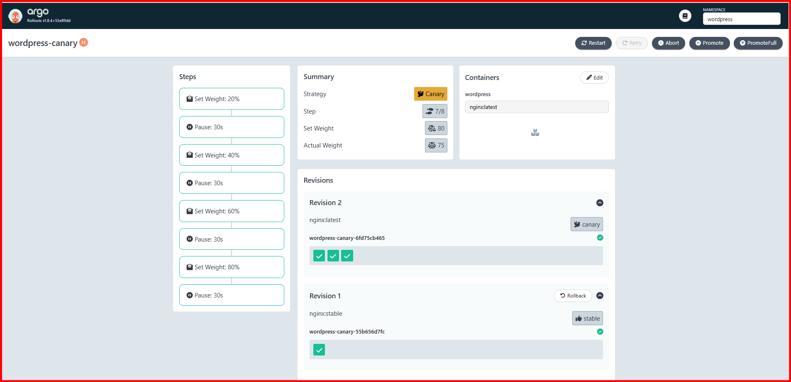
</p>
<p align="center">
  <em>Canary — Pause manuelle à 60% (validation humaine requise) &nbsp;&nbsp;|&nbsp;&nbsp; Canary — Promotion à 100% ✅</em>
</p>

<p align="center">
  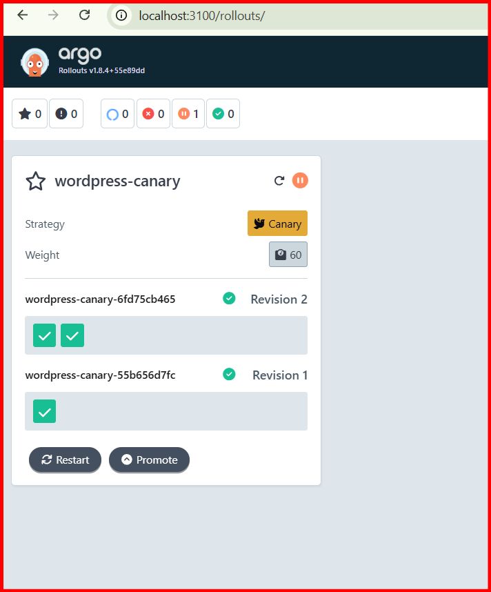
  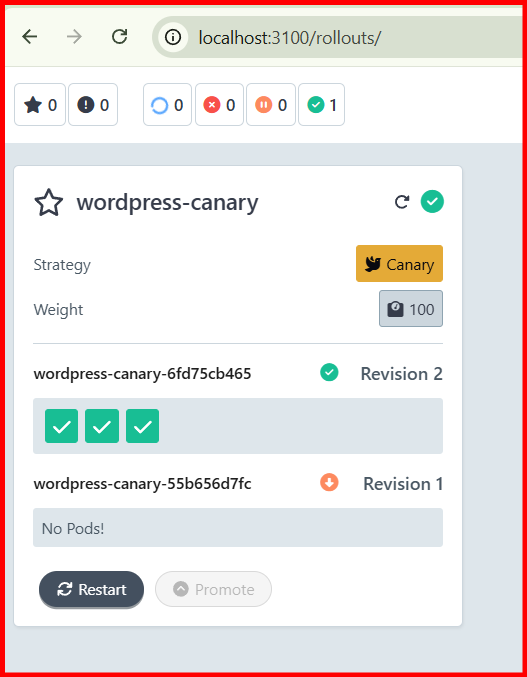
</p>
<p align="center">
  <em>Canary — Revision 2 active &nbsp;&nbsp;|&nbsp;&nbsp; Canary — Revision 1 scalée à 0 (rollout terminé)</em>
</p>

#### Screenshots — Rollback Canary

<p align="center">
  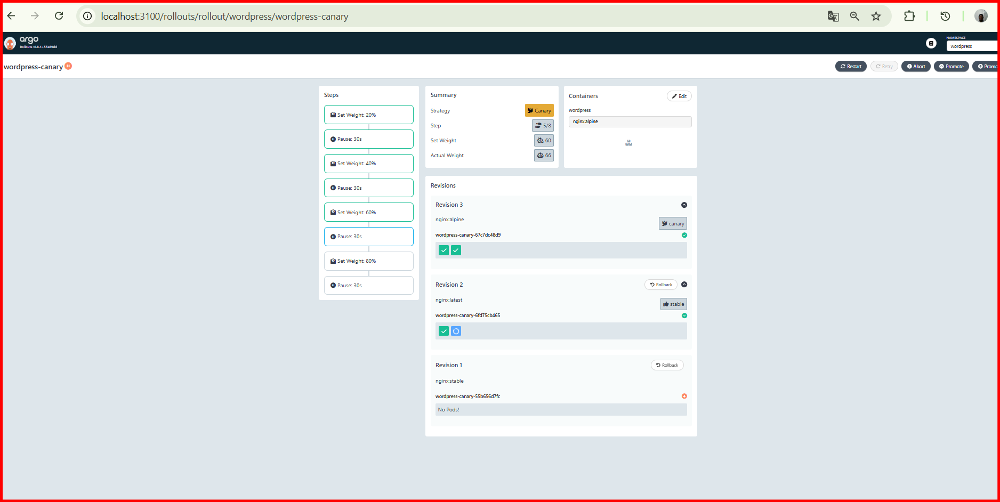
  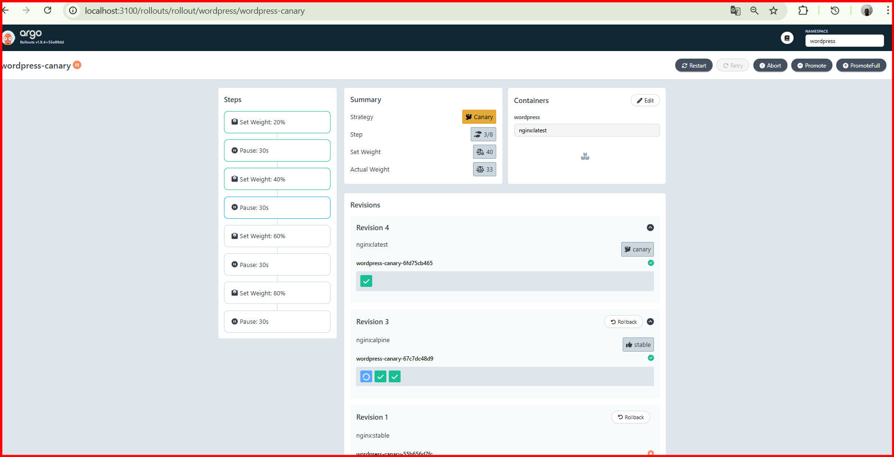
</p>
<p align="center">
  <em>Rollback — Abort déclenché, état Degraded &nbsp;&nbsp;|&nbsp;&nbsp; Rollback — Retour à la version stable ✅</em>
</p>

---

### Stratégie Blue/Green

Deux environnements identiques en parallèle. Bascule instantanée, rollback immédiat.

```
Blue (active)   ── 100% trafic prod ──────────────► scalé à 0
Green (preview) ── 0% trafic prod ─── tests QA ──► 100% trafic prod
                                         │
                                    kubectl-argo-rollouts promote
```

**Avantage** : Pas d'interruption de service, rollback en une commande.

#### Screenshots — Blue/Green en action

<p align="center">
  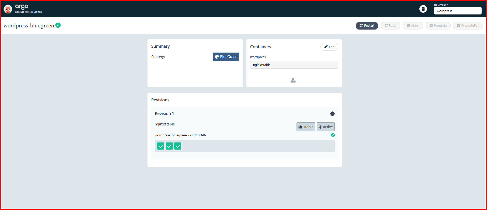
  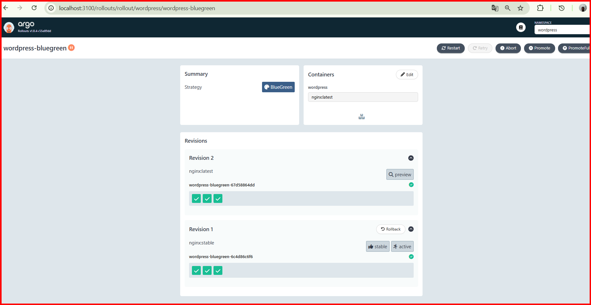
</p>
<p align="center">
  <em>Blue/Green — Blue actif (Revision 1, 100% trafic) &nbsp;&nbsp;|&nbsp;&nbsp; Blue/Green — Green Preview déployé en parallèle</em>
</p>

<p align="center">
  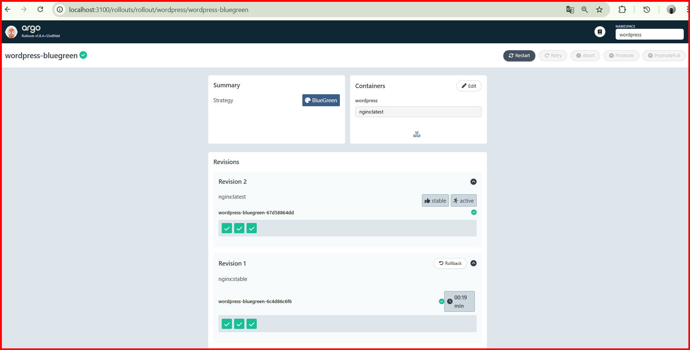
  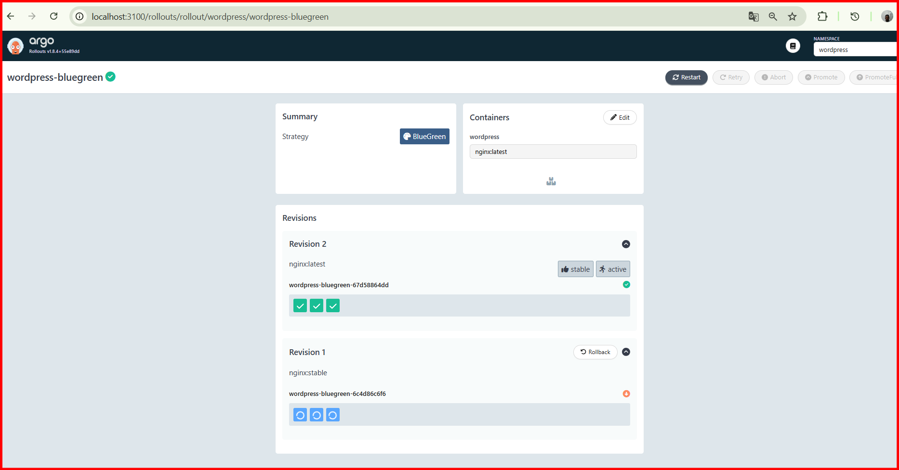
</p>
<p align="center">
  <em>Blue/Green — Deux versions actives simultanément &nbsp;&nbsp;|&nbsp;&nbsp; Blue/Green — Promotion Green → Active</em>
</p>

<p align="center">
  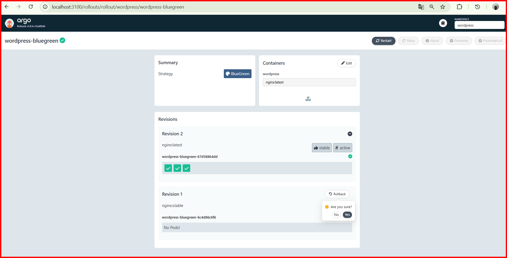
  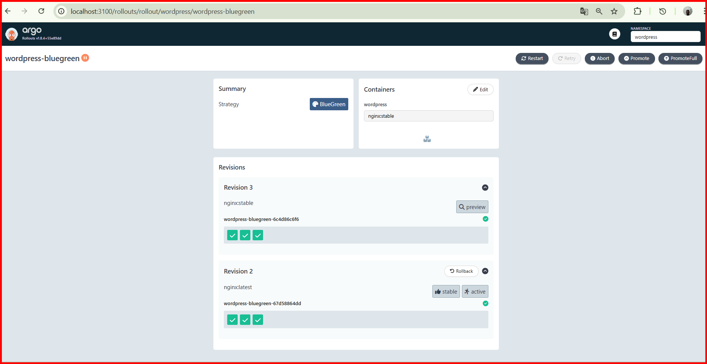
</p>
<p align="center">
  <em>Blue/Green — Green promu, Blue scalé à 0 ✅ &nbsp;&nbsp;|&nbsp;&nbsp; Blue/Green — Rollback instantané vers Blue</em>
</p>

---

## 📊 Métriques DORA

Les 4 indicateurs universels de performance DevOps mesurés via Keptn + Prometheus :

| Métrique | Définition | Valeur mesurée |
|----------|-----------|---------------|
| Deployment Frequency | Fréquence de déploiement | Collectée via Prometheus |
| Lead Time for Changes | Durée commit → production | Pipeline GitOps |
| MTTR | Temps de restauration après incident | ~15h (uptime pods) |
| Change Failure Rate | % déploiements causant incident | Argo Rollouts AnalysisTemplate |

```bash
# Voir les métriques en temps réel
kubectl get keptnmetrics -n wordpress
```

#### Screenshots — Dashboards Grafana

<p align="center">
  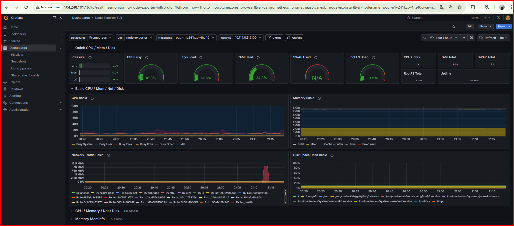
  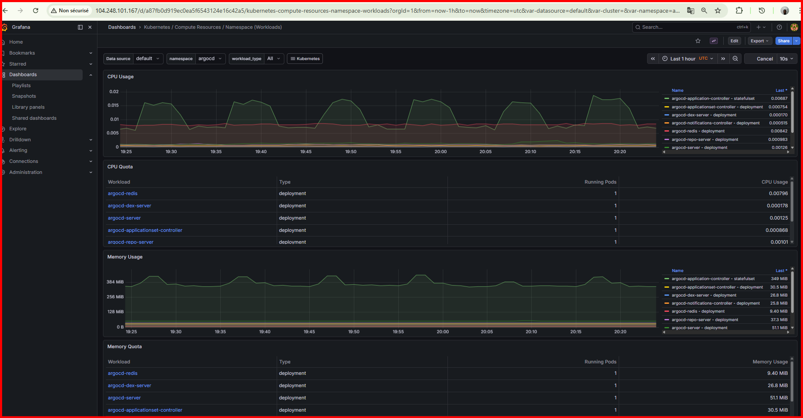
</p>
<p align="center">
  <em>Grafana — Monitoring temps réel Kubernetes &nbsp;&nbsp;|&nbsp;&nbsp; Grafana — Workloads par namespace</em>
</p>

<p align="center">
  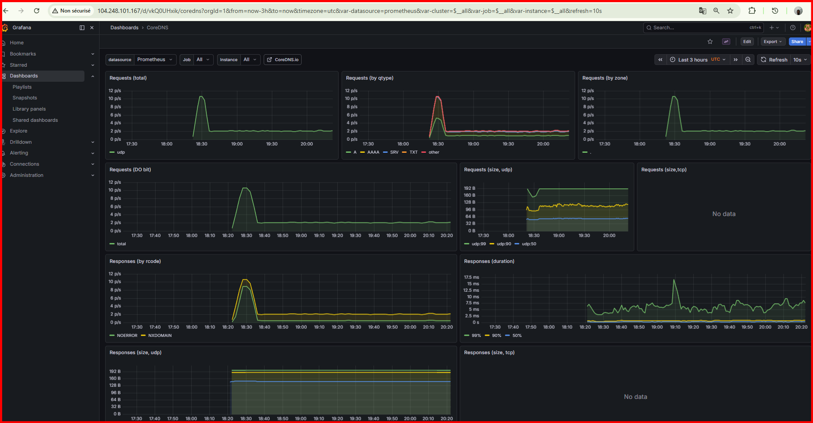
</p>
<p align="center">
  <em>Grafana — Vue globale pods et instances CoreDNS</em>
</p>

---

## 🌐 Accès aux services

| Service | URL / IP | Credentials |
|---------|----------|-------------|
| WordPress Production | wordpress.dev.local (via /etc/hosts → 168.144.4.18) | admin / (configuré) |
| WordPress Staging | wordpress-staging.local (via /etc/hosts) | admin / stagingpassword |
| ArgoCD UI | https://139.59.207.148 | admin / (secret K8s) |
| Grafana | http://104.248.101.167 | admin / (secret K8s) |
| Argo Rollouts Dashboard | http://localhost:3100 (port-forward) | - |

#### WordPress Staging en production

<p align="center">
  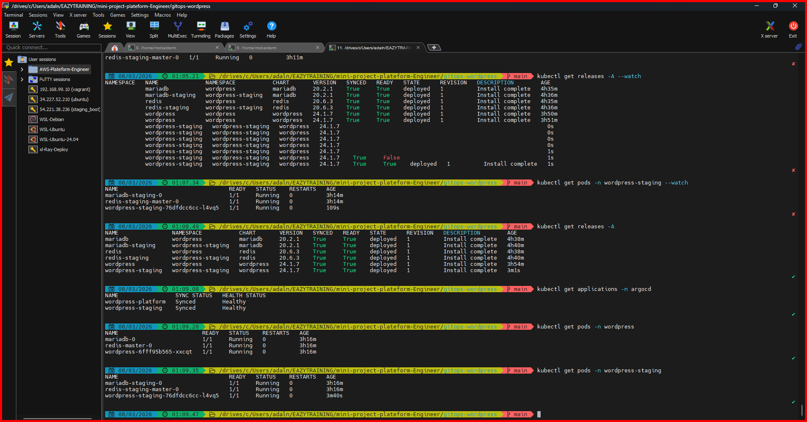
</p>
<p align="center">
  <em>WordPress Staging — Stack complète Running (MariaDB + Redis + WordPress) ✅</em>
</p>

---

## ⚙️ Installation & Reproduction

### Prérequis
- Cluster Kubernetes (DOKS recommandé, min. 2 × 4vCPU/8GB)
- kubectl, helm, git configurés
- Accès GitHub (fork du repo)

### Étapes d'installation

```bash
# 1. Ingress Nginx
helm upgrade --install ingress-nginx ingress-nginx/ingress-nginx \
  --namespace ingress-nginx --create-namespace \
  --set controller.service.type=LoadBalancer

# 2. Crossplane
helm upgrade --install crossplane crossplane-stable/crossplane \
  --namespace crossplane-system --create-namespace

# 3. Provider Helm
kubectl apply -f provider-helm.yaml
kubectl apply -f provider-helm-rbac.yaml
kubectl apply -f provider-helm-config.yaml

# 4. ArgoCD
kubectl apply -n argocd \
  -f https://raw.githubusercontent.com/argoproj/argo-cd/stable/manifests/install.yaml \
  --server-side

# 5. Applications GitOps
kubectl apply -f argocd-app.yaml
kubectl apply -f argocd-app-staging.yaml

# 6. vCluster
vcluster create vcluster-dev --namespace dev-team
vcluster create vcluster-staging --namespace staging-team

# 7. Dapr
helm upgrade --install dapr dapr/dapr \
  --version=1.14 --namespace dapr-system --create-namespace
kubectl apply -f dapr-components.yaml

# 8. Argo Rollouts
kubectl create namespace argo-rollouts
kubectl apply -n argo-rollouts \
  -f https://github.com/argoproj/argo-rollouts/releases/latest/download/install.yaml
kubectl apply -f rollout-canary.yaml
kubectl apply -f rollout-bluegreen.yaml

# 9. Monitoring DORA
kubectl apply -f https://github.com/cert-manager/cert-manager/releases/download/v1.13.0/cert-manager.yaml
helm install prometheus prometheus-community/kube-prometheus-stack \
  --namespace monitoring --create-namespace
helm install keptn keptn-lifecycle/keptn \
  --namespace keptn-system --create-namespace \
  --set certManager.enabled=false
```

---

## 🔍 Justifications Techniques

### Pourquoi Crossplane plutôt que Helm direct ?
Crossplane permet de décrire les releases Helm comme des ressources Kubernetes natives, versionées dans Git. La réconciliation est continue — si quelqu'un modifie le cluster manuellement, Crossplane remet l'état à jour automatiquement. C'est l'IaC Kubernetes-natif.

### Pourquoi ArgoCD pour le GitOps ?
Git devient la source de vérité unique. ArgoCD surveille le repo et détecte tout drift entre l'état désiré (Git) et l'état réel (cluster). Les déploiements sont traçables, auditables et réversibles via un simple `git revert`.

### Pourquoi vCluster pour les environnements ?
Créer un cluster physique par environnement coûte cher et est lent. vCluster crée des clusters Kubernetes virtuels légers (~30s) dans des namespaces dédiés, avec isolation forte (kube-apiserver dédié) et économie de ressources.

### Pourquoi Dapr ?
Les défis des microservices (state management, pub/sub, service invocation, mTLS) sont délégués au sidecar daprd plutôt qu'implémentés dans le code applicatif. Le code applicatif reste simple et portable.

### Pourquoi Argo Rollouts plutôt que les Deployments K8s natifs ?
Les Deployments K8s font du rolling update basique (tout ou rien). Argo Rollouts permet de valider automatiquement chaque étape d'un Canary via des métriques Prometheus, et de rollback automatiquement si les métriques se dégradent.

---

## 🐛 Problèmes rencontrés & Solutions

| Problème | Cause | Solution |
|----------|-------|----------|
| ImagePullBackOff Bitnami | Tags versionnés retirés de Docker Hub | `image.tag: latest` dans values Helm |
| provider-helm CrashLoop (100+ Evicted) | Nodes saturés (s-2vcpu-4GB insuffisants) | Upgrade nodes → s-4vcpu-8GB (rolling pool) |
| RBAC provider-helm | ServiceAccount généré dynamiquement | Récupération du nom exact + CRB dédié |
| PVC bloqués en Terminating | Finalizers kubernetes.io/pvc-protection | `kubectl patch pvc` → finalizers: [] |
| Dapr CrashLoop — kubeconfig manquant | Secret store K8s cherche ~/.kube/config | Annotation `dapr.io/disable-builtin-k8s-secret-store: "true"` |
| Conflit PVC lors restart WordPress | Ancien pod toujours attaché au PVC | Scale ancien ReplicaSet à 0 en premier |
| Noms releases staging incorrects | sed a modifié chart.name en plus de metadata.name | Recréation manuelle des fichiers YAML |

---

## 📈 Résultats & Bilan

```
✅ Phase 1  — Cluster DOKS + Ingress Nginx (IP: 168.144.4.18)
✅ Phase 2  — Crossplane v2.2.0 + Provider Helm v1.2.0
✅ Phase 3  — ArgoCD v3.3.2 (IP: 139.59.207.148)
✅ Phase 4  — vCluster dev + staging (v0.32.1)
✅ Phase 5  — WordPress Production (MariaDB + Redis + WordPress)
✅ Phase 6  — WordPress Staging (stack complète isolée)
✅ Phase 7  — Dapr v1.14 (sidecar 2/2 Running)
✅ Phase 8  — Argo Rollouts v1.8.4 (Canary + Blue/Green)
✅ Phase 9  — Prometheus + Grafana + Keptn DORA metrics
```

---

## 👩‍💻 Auteure

**Adalbert NANDA** — DevOps Engineer & Product Owner  
Formation Platform Engineering — EazyTraining | Mars 2026

*Stack maîtrisée : Kubernetes • ArgoCD • Crossplane • Dapr • Argo Rollouts • Keptn • Prometheus • Grafana • Helm • GitOps • DigitalOcean*

---

> 💡 **Note portfolio** : Ce projet a été réalisé intégralement sur un cluster cloud réel (DigitalOcean), avec des problèmes de production réels rencontrés et résolus. Chaque composant est justifié par un besoin métier précis, dans une logique Platform Engineering : réduire la charge cognitive des équipes applicatives tout en garantissant fiabilité, traçabilité et scalabilité.
